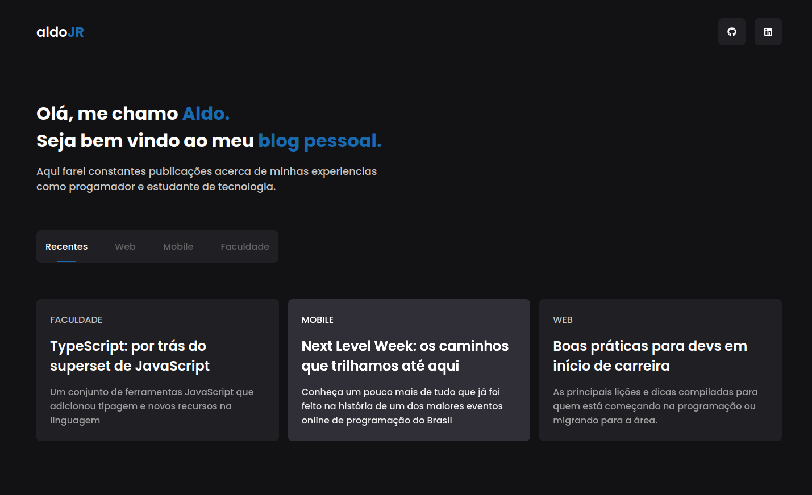
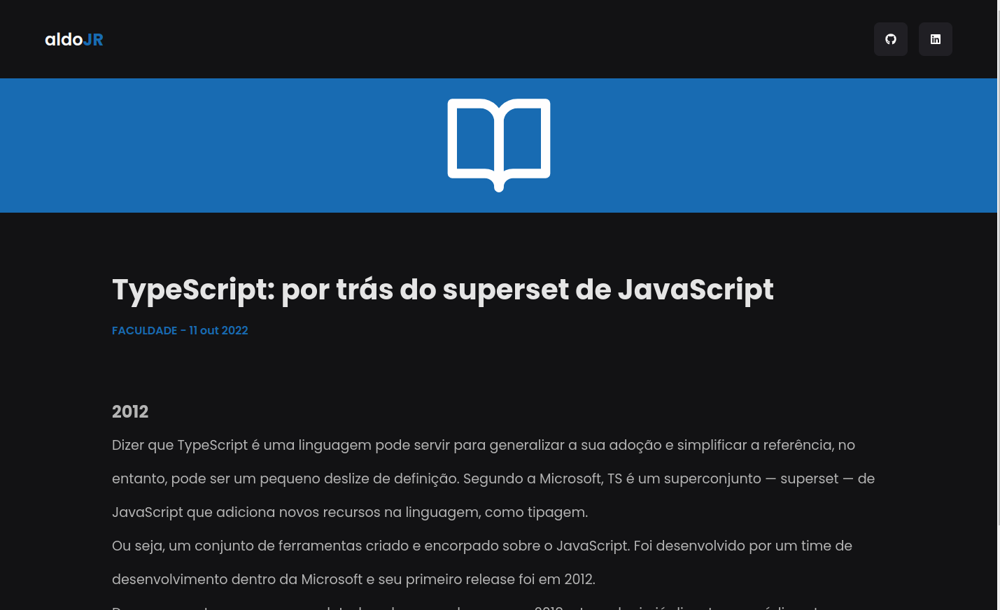

<h1 align="center">
  <strong>Meu blog pessoal</strong>
</h1>
 

## Sobre o projeto - About the project

Desenvolvi este blog com o intuito de relatar minhas experiencias como progamador e estudante de tecnologia.

<h1 align="center" display="flex">
   
</h1>

<h1 align="center" display="flex">
   
</h1>

## :computer: Tecnologias - Technologies

Este projeto foi desenvolvido com as seguintes tecnologias:
 
This project was developed with the following technologies:

- [Next](https://nextjs.org/)
- [TypeScript](https://www.typescriptlang.org/)
- [Styled-components](https://styled-components.com/)
- [useState](https://pt-br.reactjs.org/docs/hooks-reference.html)
- [getStaticProps](https://nextjs.org/docs/basic-features/data-fetching/get-static-props)
- [PrismicCMS](https://prismic.io/)
   
